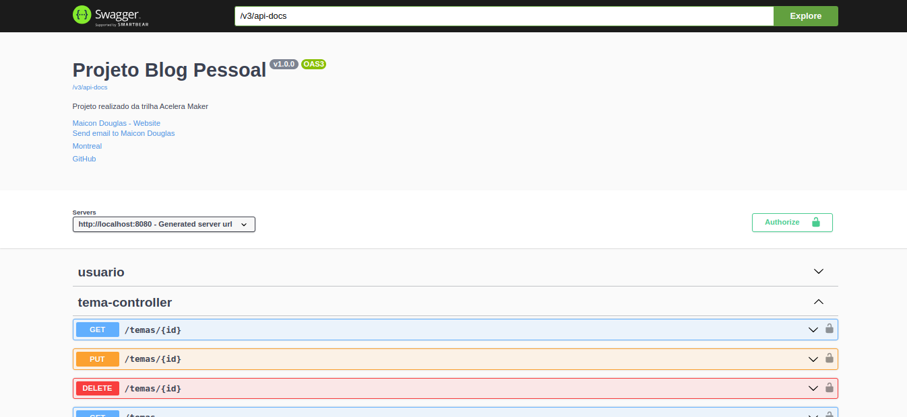

# Blog Pessoal | Back-End

Projeto desenvolvido no programa **Acelera Maker - Montreal**, com o objetivo de criar uma API RESTful para um sistema de blog pessoal. A aplicação permite o gerenciamento de usuários, temas e postagens, utilizando autenticação com JWT e seguindo boas práticas de desenvolvimento.

---

## ✨ Visão Geral

Esta aplicação foi construída em Java com o framework Spring Boot. Ela é responsável por fornecer os serviços de backend para um blog, incluindo:

- Registro e autenticação de usuários com tokens JWT
- Criação, leitura, atualização e remoção de postagens
- Gerenciamento de temas e associação com postagens
- Validações de entrada e segurança nas rotas protegidas

---

## 🛠️ Tecnologias e Ferramentas

- Java 17
- Spring Boot
- Spring Web
- Spring Data JPA
- Spring Security
- JWT (JSON Web Token)
- Banco de Dados: MySQL (ou PostgreSQL)
- Maven
- Swagger (OpenAPI)

---

## 🔐 Funcionalidades de Segurança

- Login e senha criptografada com BCrypt
- Geração de token JWT após autenticação
- Controle de acesso baseado em roles
- Filtros de autenticação configurados via Spring Security

---

## 🧪 Testes

Os testes foram realizados de forma manual utilizando:

- **Postman**
- **Insomnia**

Projeto preparado para testes automatizados com **JUnit**, cobrindo camadas de controller e repository.

---

## 🧰 Boas Práticas Implementadas

- Uso de **DTOs** para trafegar dados entre camadas
- **Validações com Bean Validation**, utilizando `@Valid` e `@NotBlank`
- Estrutura organizada com camadas: Controller, Service, Repository, Security, Config
- Princípios de responsabilidade única e injeção de dependência
- Documentação interativa com Swagger

---

## 📘 Documentação da API

A documentação da API pode ser acessada via Swagger:

👉 [Acessar Swagger UI](http://localhost:8080/swagger-ui/index.html#/)



---

## 📌 Endpoints Principais

| Recurso   | Método | Endpoint                        | Descrição                            |
|-----------|--------|----------------------------------|----------------------------------------|
| Usuário   | POST   | /usuarios/cadastrar             | Cadastro de novo usuário              |
| Usuário   | POST   | /usuarios/logar                 | Autenticação e geração de token JWT   |
| Usuário   | PUT    | /usuarios/atualizar             | Atualização dos dados do usuário      |
| Postagem  | GET    | /postagens                      | Lista todas as postagens              |
| Postagem  | POST   | /postagens                      | Cria nova postagem                    |
| Tema      | GET    | /temas                          | Lista todos os temas                 |
| Tema      | POST   | /temas                          | Cria novo tema                       |

---

## 🚀 Como Rodar o Projeto

Siga os passos abaixo para clonar e executar o projeto localmente:

```bash
# Clone o repositório
git clone https://github.com/maicon8850/projeto-blog.git

# Acesse o diretório do projeto
cd projeto-blog

# Rode o projeto com Maven (necessário Java 17+)
./mvnw spring-boot:run

O projeto estará disponível em: 📍 http://localhost:8080

Acesse a documentação da API: 📘 http://localhost:8080/swagger-ui/index.html

src
 └── main
     ├── java
     │   └── br.com.montreal.projeto_blog
     │       ├── configuration
     │       ├── controller
     │       ├── dto
     │       ├── model
     │       ├── repository
     │       ├── security
     │       └── service
     └── resources
         ├── application.properties
         └── static / templates
